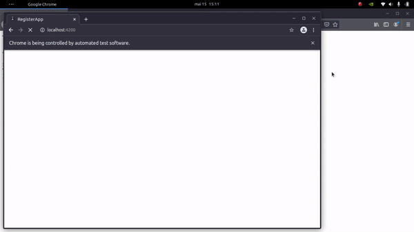
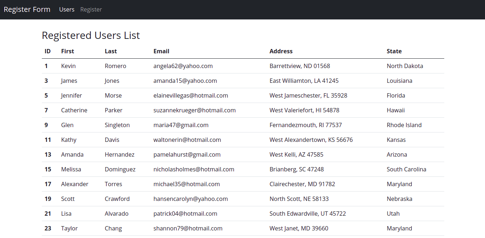
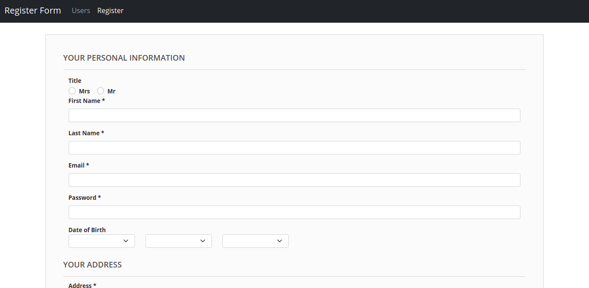

# Project to Automate filling in registration form

... in progress

The main objective of this project is to use the python selenium framework to automatically fill out a registration form.

* The registration page was implemented using the angular framework;
* To generate the data for tests the Python Faker library was used;
* A Rest API has been implemented to communicate with a database in order to persist the registered data.

### Project Preview

